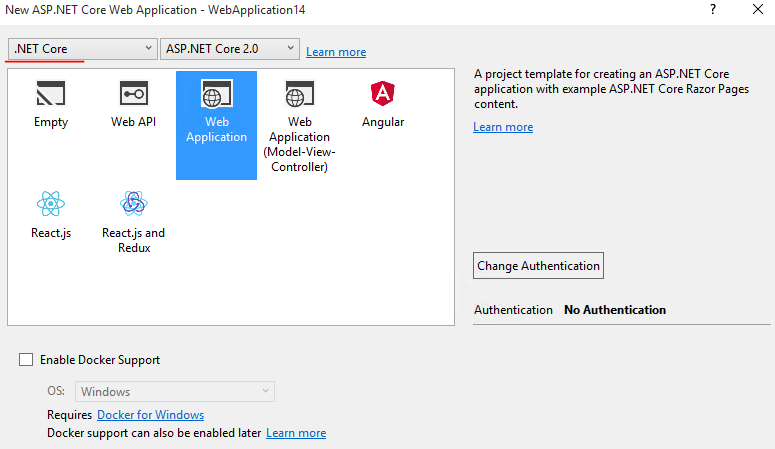
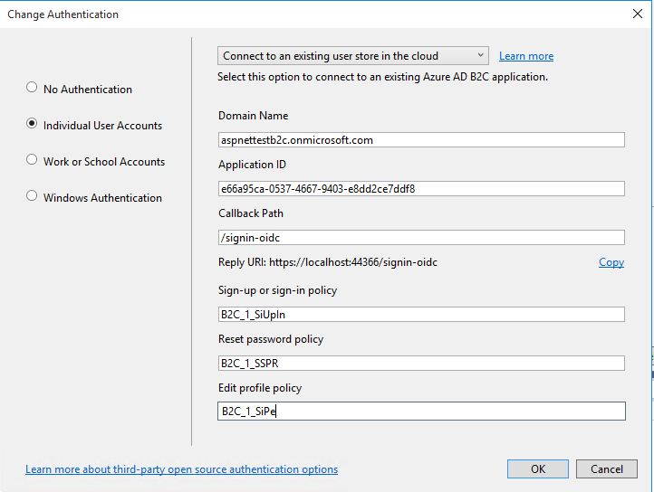
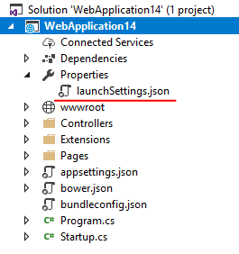
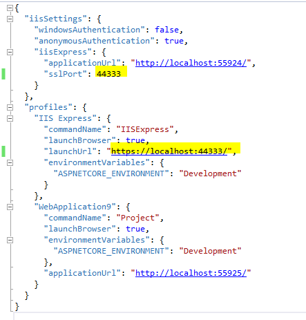
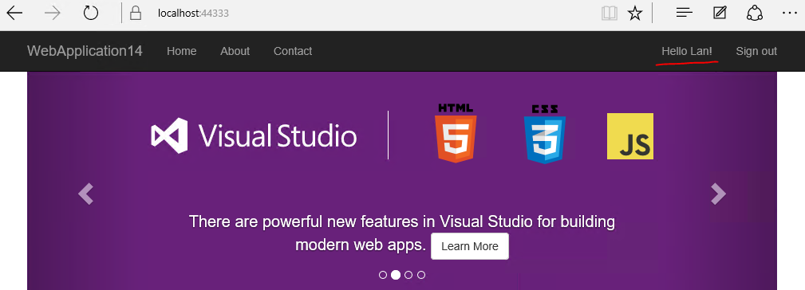

## Walkthrough Steps

### Create project with Azure Functions template 

1. File > New Project > Web > ASP.NET Core Web Application.
	
2. In the New ASP.NET Core Web Application dialog, select ASP.NET Core 2.0 (test with both .NET Core and .NET Framework).
	
3. Select the template (Web Application or Web Application (Model-View-Controller)).
	
    

4. Click on Change Authentication . 
	
5. In the Change Authentication dialog select Individual User Accounts.
	
6. From the drop down select Connect to an existing user store in the cloud.

7. Specify the following parameter values:
	
    - Domain Name: aspnettestb2c.onmicrosoft.com
	- Application ID: e66a95ca-0537-4667-9403-e8dd2ce7ddf8
	- Sign-up or sign-in policy: B2C_1_SiUpIn
	- Reset password policy: B2C_1_SSPR
	- Edit profile policy: B2C_1_SiPe

    

8. Click OK in the Change Authentication dialog and in the New ASP.NET Core Web Application.

9. Once the project has been created and NuGet package restore has completed, expand the Properties node in the solution explorer and open launchSettings.json.
	
    

10. Change the sslPort property and the port of the IIS Express launch URL in launchSettings.json to 44333 and save the file.

    

### Build and run

1. Hit Ctrl-F5 to run the app.

2. When the app pops up in the browser tap the “Sign in” link to browse to the B2C login page for the app.

3. On the B2C login page tap on the “Sign up now” link.

4. Create a new user using a valid email address that can be verified, or, if you already have an existing user then sign in with that user.

5. You should now be logged in with your new user and see your display name on the nav bar. If you don’t see your display name, go back to the portal and make sure you selected the display name claim for all of your policies.
	
    

6. Sign out.

7. Click “Sign in” again and tap on “Forgot your password?” link.

8. Enter and validate your email address and then change your password. You should now be logged in with your new user and see your display name on the nav bar.

9. Sign out and then sign in again using your new password.

10. Click on your display name to navigate to the B2C edit profile page for your app.

11. Change your display name and tap continue.

12. You should now see your new display name on the home page.
