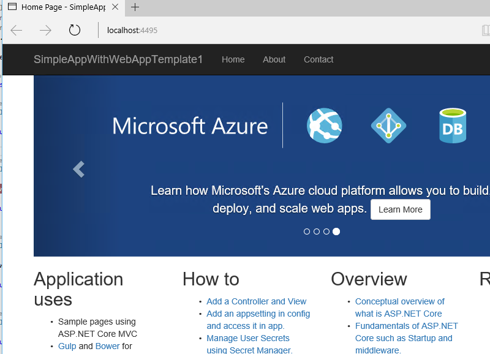
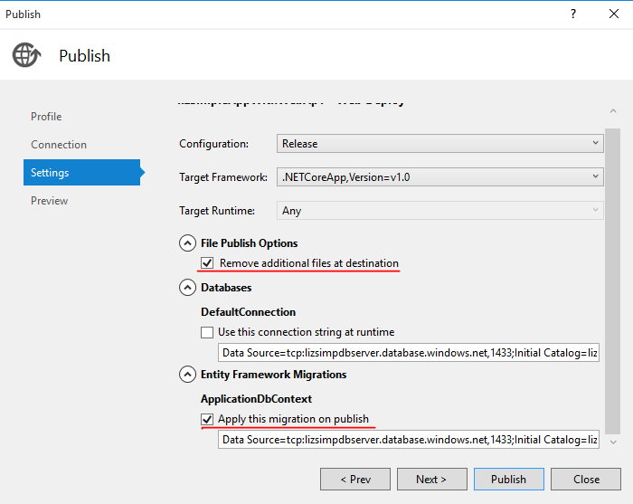
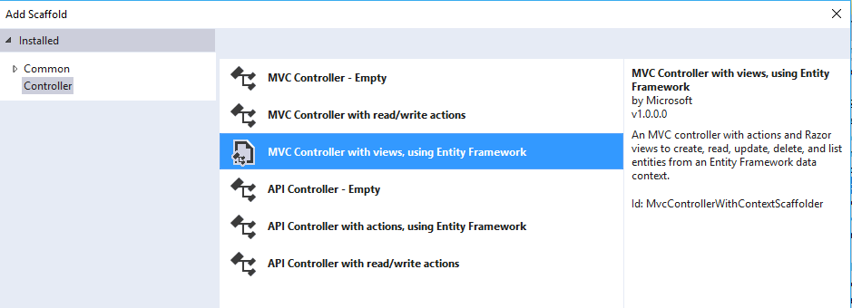

## Contexts
|ProjectTargetFrameworks|Framework Version| Template |
| ------------- |:-------------:| -----:|
| ASP.NET Core Web Application (.NET Core)|2.0|Web Application|
| ASP.NET Core Web Application (.NET Framework)|2.0| Web Application|
| ASP.NET Core Web Application (.NET Core) |2.0|Web Application (Model-View-Controller)|
| ASP.NET Core Web Application (.NET Framework) |2.0|Web Application (Model-View-Controller)|

## Walkthrough Steps

### Create project with Web Application template 

1. File > New Project > ASP.NET Core Web Application. Give a name, eg:SimpleWebAppWithIndAuth1.
Choose either one of these two templates - "ASP.NET Core Web Application" or "ASP.NET Core Web Application on .NET Framework".

2. Check the checkbox for "Create new Git repository"

3. Select "Web Application" or "Web Application (Razor Pages)" template in the One Asp Net dialog, change authentication to "Individual Accounts"

	**Note:** 

	For KRC2, "Individual Accounts" is the default auth selected

	For KRTW and above, "No Authentication" is the default auth selected

4. Wait till package restore completes.
			
### Build and run 

1. Open Startup.cs, build the project. Verify no errors or warnings in the output window and in the error list.

	

	

	

2. Add a breakpoint in the About method of HomeController.cs.

	 

3. Run the project (F5) and verify you get the default page to show up in the browser.

	

4. Go to About page and verify that the breakpoint gets hit.

	

5. Continue F5 and then try to Register a new user.
			
6. Click Register and Verify user registered successfully and signed in.

	

		
	
	

	**Note:**

	* You will initially get this screen below. This is expected. If you hit "Apply Migrations" button, then the Register will work.

	

	

	

	* For X86 OS may meet error, run the following cmd:

			sqllocaldb s mssqllocaldb 
			sqllocaldb delete mssqllocaldb 
			sqllocaldb create mssqllocaldb 
			sqllocaldb s mssqllocaldb 

### Publish to Azure

1. Right-click project > Publish, choose Azure App Service > New > Create New Web app in existing or new Resource Group / App Service Plan.

	

	
	
	

2. Provision a database as well in the "Services" tab.

	

	
	
	

	

3. Connection tab > Validate Connection.

4. Settings tab, pick the default options, select "Remove additional files at destination" and select "Apply migrations" checkbox.

	

	

	

5. Preview.

6. Publish to Azure, verify home page loads properly on published Azure site.

7. Register a new user on the published Azure site, and verify that works, too
	
	**NOTE:**
	
	Remember to clean up the created web app or resource group if the test was completed successfully.
	
### Scaffold a MoviesController with Views (based on the tutorial here)

1. In Solution Explorer, right click the Models folder > Add > Class. Name the class Movie and add the following properties.
			
		public class Movie
			{
				public int ID { get; set; }
				public string Title { get; set; }
				public DateTime ReleaseDate { get; set; }
				public string Genre { get; set;}
				public decimal Price { get; set; }
			}

2. Right-click the Controllers folder > Add > Controller.In the Add Scaffold dialog, tap MVC Controller with views, using Entity Framework > Add.
	
	

	

	

3. Complete the Add Controller dialog:
		
		Model class: Movie(MvcMovie.Models - your namespace) 
		Data context class: ApplicationDbContext 
		Views: Keep the default of each option checked
		Controller name: Keep the default MoviesController
		
	

	

	

4. Tap Add.

5. Verify Output window - Code Generation Log pane shows that scaffolding completed successfully, and the MoviesController and cshtml files under Views\Movies got added in Solution Explorer.

	

6. Ctrl-F5 and navigate to "/Movies" in the browser, you will see the following error. As the error mentions this is because EF migrations have not been applied.
			
	

	

	

7. Add and apply EF migrations to get the database ready for our MoviesController.
	
		a. Open Package Manager Console (PMC)

	

	

	

		b. Type "Add-Migration AddMovies"

	

	

	

		c. Type "Update-Database"
		
8. Ctrl-F5 and navigate to "/Movies" in the browser. The page should load fine in the browser now.
			
	

	

	

9. Click "Create New" and verify you can add 1 or more new movies.View Details, make an Edit to a movie you added.Delete a movie you added.

10. Check-in changes to Source Control
		
		a. Save all changes to the solution.
		b. Go to Team Explorer - Changes, verify the right files show up. 
		c. Type in a comment and commit all the changes.
		
11. Publish to Azure
		
		a. Settings tab, make sure select "Remove additional files at destination" and select "Apply migrations" checkbox are still checked
		b. Publish to same Azure web app that you created in step 4 above - do Publish Preview first, then do the actual publish
		c. Verify you can navigate to "/Movies" on the published web app on Azure
		d. Verify you can create / view details / edit / delete movies on the published web app on Azure
