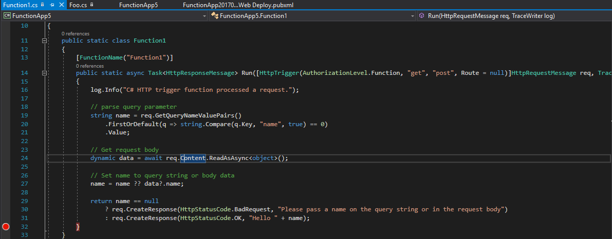
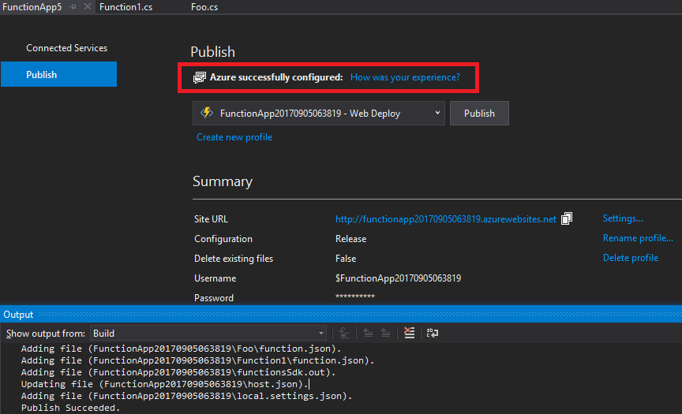
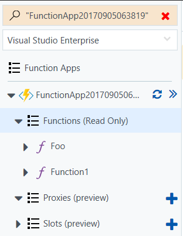

## Walkthrough Steps

### Create project with Azure Functions template 

1. File > New Project > Azure Functions Give a name, eg: FunctionApp

    

    

    

2. Create a storage account in Azure.
	
    a. Go to the Azure portal and search "Storage Accounts" in the query box. Select "Storage accounts". 
	
    b. Hit "Add" in the top left corner.
	
    c. Create the storage account with any settings you wish (defaults are fine).
	
	

    

    

		
3. Update appsettings.json with Storage Account information.

	a. Navigate to your newly created storage account -> AccessKeys and copy the Connection String from key1 (you can use the copy button to do this as well).

    

    

    

		
	b. Go to your local.settings.json in your project and set the values of both the "AzureWebJobsStorage" and "AzureWebJobsDashboard" values to the connection string.
		
	

    

    

4. Create functions.
	
    a. Right click project -> Add New Item-> New Azure Function...  The "Azure Function" item template should be selected. Verify it shows below Class and Class for U-SQL but above the Interface template. Input a name for the Azure Function (ex. Foo.cs) Click the "Add" button to pop open this window:
		
	

    

    

	b. Select the Blob trigger function and set the connection to "AzureWebJobsStorage".
	
    c. Click OK.
	
    d. Verify that the function file was created (such as Foo.cs). 
	
	

    

    

	e. Repeat steps (a-d) for the Http trigger function. Leave the access rights to "Function". 
		
### Debug/Run the functions locally

1. Hit F5. You will get dialog telling you to update the Azure Functions CLI to the latest version. Verify this. Hit Yes.
		
	

    

    

		
	Verify that the following func.exe command prompt appears:
		
	

    

    

		
2. Go to https://go.microsoft.com/fwlink/?linkid=835724 and verify that the version of the func.exe (the number before "\func.exe" in the top of the command prompt, in this case 1.0.2) matches the "version" property in the json file in the link. 
		 
3. Put a breakpoint on the closing brace of the Run method for the two functions you created like so:
		
	

    

    

	

    

    

4. Go to an internet browser and go to the URL http://localhost:7071/api/Function1?name=World. Verify that the breakpoint for your Http trigger file hits. Hover over "name" and verify that the value is "world". 
		
	

    

    
	
		
5. Hit F5. Verify that you see "Hello World" in your browser. 
		
	

    

    
	
		
6. Download and install Microsoft Azure Storage Explorer on ANY machine you have (it doesn't have to be your test machine. If you have a machine with storage explorer already, you do not need to install it again.) You can do so from here: http://storageexplorer.com/ Open up the app. 	

7. Sign in with your Azure account in Storage Explorer. Go to {Your subscription} -> Storage Accounts -> {Azure Functions Storage Account name} -> Blob Containers. Right click on the Blob Container node -> Create Blob Container. Name your new blob container "samples-workitems".  
		
	

    

    

8. On the top left of the samples-workitems tab, click Upload -> Upload Files … and select any file on your file system and upload it. In this case I've uploaded an html file.
		
	

    

    
	
		
9. Go back to your Blob Trigger file and make sure that the breakpoint hit. Also hover over the "name" parameter in the Run method and make sure that it is the file name you've uploaded.
		i. Hit F5. Check the func.exe to make sure that it wrote down the size of the file as well as the name of the file uploaded. 
		
	

    

    

			 
### Publish the Functions project to Azure
	
1. Close the func.exe command prompt. 
		
2. Right click the project -> Publish. Make sure the "Azure Function App" is selected and the "Create New" radio button is selected. Hit "Publish".
	
	

    

    

3. Enter your Azure account credentials if necessary. Create new Resource Groups and App Service plans. 

4. Hit Create.

5. Verify in the Output window that Build and Publish both succeeded and if you are on an ENU VS version 15.4 or greater that the "Azure successfully configured" link shows up. If you aren't, verify that the link does NOT show up. (For details, please refer to Customer Effort Survey link)

	

    

    
	
		
6. Go to Tools -> Extensions and Updates -> Updates and make sure that there are no updates needed for Cloud Explorer. If there are, hit update, close Visual Studio, and let the Cloud Explorer installer install the latest version. Reopen Visual Studio if you've updated Cloud Explorer. 

7. Go to Cloud Explorer.Open up the blue dropdown and select Resource Groups. Search for the name of the Function App you provisioned. (here it is FunctionApp220170905063819). Verify that the app exists, the icon is correct, and that they are both under the resource group you had selected in step (c).Update Cloud Explorer: Cloud Explorer private build setup (steps 5 - 9).

8. Right click the function app node -> Open in portal. Verify that the two functions you've created are there and the names are correct.
	
	

    

    
	

9. Go back to Visual Studio and click on the settings link in summary in the publish pane. Set configuration to "Debug". Hit the save button.  
		
	

    

    
	

	

    

    

10. Hit the publish button again. Repeat step (i) again.

### Debug published Functions 
	
1. In cloud explorer, right click on your functionApp -> Attach Debugger.
		
2. In the portal, go to your Blob trigger function and expand the logs by clicking on the blue expander arrow.
		
	

    

    

		
3. Click on the FunctionApp node in the portal and go to "Application settings" under general settings. Find the AzureWebJobsStorage field and look for the "AccountName=" substring in the value. Copy the value of the AccountName (do not include the semicolon). This is the account that got generated during provisioning. 
		
	

    

    

4. Search for this storage account in Storage Explorer(you installed on another machine). Verify that the storage account shows up. Repeat step (5f) for the new account. (close you search result, and open your new storage account),name your new blob container "samples-workitems".
		
	

    

    

5. Upload another file to the storage account (the new one if you did step (c).) 

6. Verify that the breakpoint in your Blob trigger file in Visual Studio hit and that the name parameter is the name of the file you just uploaded. Hit F5.

7. Verify that the logs in the portal print the name and size of the file you uploaded.

	

    

    
	
		
8. Go to your HttpTrigger in the portal. Click on the "Get function URL" link and hit the copy link in the popup. Copy this in a new browser tab and append "&name=world" to the end of the URL.  
		
	

    

    

9. Hit enter and Verify that the breakpoint for your Http trigger file hits. Hover over "name" and verify that the value is "world". Hit F5.

10. Verify that the browser shows "Hello world". 

	

    

    

		
	  
